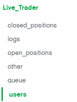
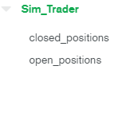
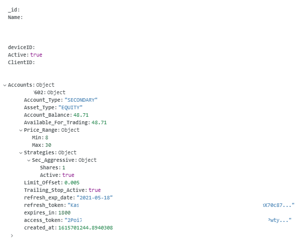

# Python Trading Bot w/ Thinkorswim

## Description

- This program is an automated trading bot that uses TDAmeritrades Thinkorswim trading platform's scanners and alerts system.

## Table Of Contents
- [How it works](#how-it-works)

- [Dependencies](#dependencies)

- [Setup](#setup)

    - [MongoDB](#mongo)
    - [Gmail](#gmail)
    - [Pushsafer](#pushsafer)
    - [TDA API Tokens](#tokens)
    - [Thinkorswim](#thinkorswim)

        - [Scanner Names](#scanner-names)
        - [Scanner Offset](#scanner-offset)
        - [Scanner Alerts](#alerts)

- [Results](#results)

- [Discrepencies](#discrepencies)

- [What I Use and Costs](#what-i-use-and-costs)

- [Final Thoughts and Support](#final-thoughts-and-support)

##  How it works (in a nutshell)

### Thinkorswim:

    1. USER CREATES STRATEGIES IN THINKORSWIM.
    2. USER THEN CREATES SCANNERS FOR THOSE STRATEGIES. (SCANNER NAME HAS SPECIFIC FORMAT)
    3. USER THEN SETS EMAIL ALERTS TO USER SPECIFIC GMAIL ADDRESS THAT IS SETUP THROUGH THE THINKORSWIM PROGRAM.
    4. WHEN NEW SYMBOL IS POPULATED INTO THE SCANNER, AN ALERT IS TRIGGERED, AND AN EMAIL IS SENT.

### Trading Bot:

    1. BOT CONTINUOUSLY SCANS GMAIL ACCOUNT, LOOKING FOR ALERTS.
    2. ONCE ALERTS ARE FOUND, BOT PICKS APART EMAIL INFO TO DETERMINE WHICH STOCKS NEED TO BUY/SELL FOR WHICH STRATEGY.

- You can only buy a stock once per strategy, but you can buy the same stock on multiple strategies. Unlimited shares, obviously. It's very diversified.

- MongoDB database stores and keeps track of all of your open and closed positions, along with other data. Completely seperated from TDAmeritrade.

- This is setup for both EQUITY and OPTIONS trading, but I have not traded OPTIONS on this as of yet.

- Flow
  1. Alert from Gmail is received.
  2. Data from alert is stripped of needed info.
  3. If buy order, then open positions in Mongo is checked for any open positions with the same symbol and strategy.
  4. If nothing found, a buy order is placed.
  5. Same goes for sell order.
  6. If sell order, then open positions in Mongo is checked for open position with same symbol and strategy.
  7. If found, then sell order is placed.

##  Dependencies

> [dev-packages]

- pylint
- bandit
- pandas
- tabulate

> [packages]

- google-api-python-client
- google-auth-httplib2
- google-auth-oauthlib
- python-dotenv
- pymongo
- dnspython
- termcolor
- colorama
- requests
- pytz
- psutil

> [venv]

- pipenv

> [requires]

- python_version = "3.8"

##  Setup

- Assuming that you already have a TDAmeritrade account and the Thinkorswim desktop application already downloaded, we will move on to the next step.

###  MONGODB

- Create a MongoDB [account](https://www.mongodb.com/), create a cluster, and create two databases with the following names:

  1. Live_Trader
  2. Sim_Trader

- The Live_Trader database will contain all the important data used for actual live trading.

- The Sim_Trader database will be used for simulated trading, basically buying and selling everything, regardless of buying power. Pretty much paper trading without going through the TDA api.

- You will need the mongo uri to be able to connect pymongo in the program. Store this uri in a .env file within your mongo package in your code.

- The images below shows the structure of how the databases and users collection is setup:

- Most of the Live_Trader collections are used to collect long term data for use on my front end web app I have developed, which is not public at this time.

- The most crucial collections are:

  1. users
  2. queue
  3. open_positions
  4. closed_positions
  5. other

- The users collection store all users and their individial data, such as name and accounts.

- The queue stores non-filled orders that are working or queued, until either cancelled or filled.

- The open_positions stores all open positions and is used to help determine if an order is warranted.

- The closed_positions stores all closed positions after a trade has completed.

- The other stores all rejected and cancelled orders. Rejected typically happens if not enough buying power, and I have it set to cancel buy orders that have been sitting in queue for 2 hours or more.

- The image above shows the structure of how a user is setup. In the Accounts object, the key is the account number, and the value is another object with all of that account info and the tokens. All of this will auto populate into the users collection once you create your API tokens for TDAmeritrade using this [repo](https://github.com/TreyThomas93/TDA-Token) here.

###  Gmail

- First off, it is best to create an additional and seperate Gmail account and not your personal account.

- Make sure that you are in the account that will be used to receive alerts from Thinkorswim.

- You will need to create and turn on Google Docs API.
  https://developers.google.com/docs/api/quickstart/python

- Once created, save the credentials.json file to the creds directory within your gmail package in the program. This will be converted to token.json. After that, you can delete the credentials.json file.

- Run the program to see if you connect to Gmail. You will be prompted to sign in to your account. Make sure you sign in with the account you will be using with Thinkorswim for the program. You may be given an Unverified Apps screen. If so, follow this:

  1. Click the advanced button bottom left.
  2. Click the Go to Quickstart (unsafe) button.
  3. Click Allow.
  4. Click Allow again.
  5. You then will be redirected to a callback of localhost with the message "The authentication flow has completed. You may close this window."
  6. Exit out, and you should be connected.

- Once verified, you may have to go to your Google Developers Portal to enable your app.

- Now you should be able to fully connect. If the token.json gets removed, you will not be able to connect.

- Let me know via email if you have issues, and I can help guide you through the process.

###  Pushsafer

- Pushsafer allows you to send and receive push notifications to your phone from the program.

- This is handy for knowing in real time when trades are placed.

- You can also receive error notifications, but I stopped that for now.

- The first thing you will need to do is register:
  https://www.pushsafer.com/

- Once registered, read the docs on how to register and connect to devices. There is an Android and IOS app for this.

- You will also need to pay for API calls, which is about $1 for 1,000 calls.

- You will also need to store your api key in your code in a .env file that is stored in your push_notification package.

###  TDAmeritrade API Tokens

- You will need an access token and refresh token for each account you wish to use.
- Here is my [repo](https://github.com/TreyThomas93/TDA-Token) to help you to get these tokens and save them to your mongo database, in your users collection.

###  Thinkorswim

- If you are familiar with creating strategies and setting up scanners, then this part should be easy.
- There are some things that we need to make sure are done correctly, such as the following:
  1. Make sure the scanner names are formatted correctly so the program can use them.
  2. Make sure the scanner logic is setup correctly so the alerts trigger at the correct time.
  3. Make sure your alerts are set up correctly.

####  Scanner Names

- The format for the scanner name should look like this: STRATEGY, SIDE, AGGREGATION, ASSET TYPE, ACCOUNT TYPE

- Example: 

  1. REVA is the strategy name.
  2. SELL is the side. Can be BUY, SELL, BUY_TO_OPEN, SELL_TO_CLOSE
  3. 4h is the aggregation. ex. 30m, 1h, 4h, D
  4. EQUITY is the asset type. Can be EQUITY OR OPTION
  5. PRIMARY is the account type. Can be PRIMARY, SECONDARY, ect.... (Subject to change to Day, Swing)

- Must be in this exact order and spelled correctly for this to work properly.

####  Scanner logic offset

- The scanners need to be offset by one in order to send a non-premature alert. It needs to look at the previous bar for whatever aggregation you have set for it. This will look at the last bar to see if it met criteria, and if so, triggers an alert. The reason for this is that if we used the current candle, and this is based on experience, the symbols will populate and then be removed constantly throughout that aggregation, and may not actually meet criteria by the end.

- This is how an entry strategy in the charts may look.

- This is how the scanner should look for the exact same entry strategy.

- The only thing that changed was that [1] was added to offset the scanner by one and to look at the previous candle.

####  Setting up Alerts

- When setting up alerts, make sure you select to send an alert everytime a symbol is added, or this will not work.
- Also, make sure that the email box is checked to allow the alerts to be sent to your gmail.

###  Results

- I have been using this since October 2020, and without giving to much detail, I can vouch that it is profitable. That being said, everyone's experience will be different, and not everyone will share the same results.

- Obviously, results are based off of how good your strategies that are developed in Thinkorswim are.

###  DISCREPENCIES

- This program is not perfect. I am not liable for any profits or losses.
- There are several factors that could play into the program not working correctly. Some examples below:

  1. TDAmeritrades API is buggy at times, and you may lose connection, or not get correct responses after making requests.
  2. Thinkorswim scanners update every 3-5 minutes, and sometimes symbols wont populate at a timely rate. I've seen some to where it took 20-30 minutes to finally send an alert.
  3. Gmail servers could go down aswell. That has happened in the past, but not very common.
  4. And depending on who you have hosting your server for the program, that is also subject to go down sometimes, either for maintenance or for other reasons.
  5. As for refreshing the refresh token, I have been running into issues when renewing it. The TDA API site says the refresh token will expire after 90 days, but for some reason It won't allow you to always renew it and may give you an "invalid grant" error, so you may have to play around with it or even recreate everything using this [repo](https://github.com/TreyThomas93/TDA-Token). Just make sure you set it to existing user in the script so it can update your account.

- The program is very indirect, and lots of factors play into how well it performs. For the most part, it does a great job.

###  What I use and costs

> SERVER FOR HOSTING PROGRAM

- PythonAnywhere -- $7 / month

> DATABASE

- MongoDB Atlas -- Approx. $60 / month

> NOTIFICATION SYSTEM

- PushSafer -- Less than $5 / month

###  FINAL THOUGHTS

- This is in continous development, with hopes to make this program as good as it can possibly get. I know this README might not do it justice with giving you all the information you may need, and you most likely will have questions. Therefore, don't hesitate to contact me either via Github or email. As for you all, I would like your input on how to improve this, and I also heavily encourage you to fork the code and send me your improvements. I appreciate all the support! Thanks, Trey.

- If you like backtesting with Thinkorswim, here's a [repo](https://github.com/TreyThomas93/TOS-Auto-Export) of mine that may help you export strategy reports alot faster.

- Also, If you like what I have to offer, please support me here!

> 
