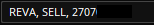
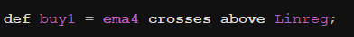
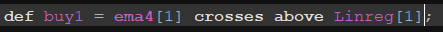
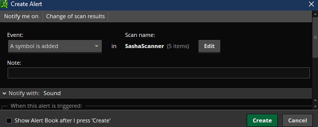
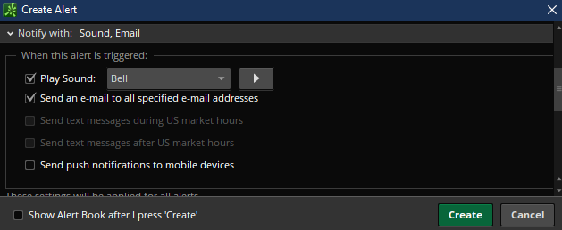
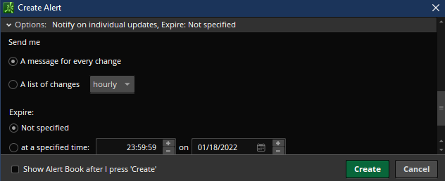

# Python Trading Bot w/ Thinkorswim

## Description

- This automated trading bot utilizes TDAmeritrades API, Thinkorswim Alert System, Gmail API , and MongoDB to place trades, both Equity and Options, dynamically. _**This bot only works for LONG positions as of now**_

##  How it works (in a nutshell)

### **Thinkorswim**

1. Develop strategies in Thinkorswim.
2. Create a scanner for your strategy. (Scanner name will have specific format needed)
3. Set your scanner to send alerts to your non-personal gmail.
4. When a symbol is populated into the scanner, an alert is triggered and sent to gmail.

### **Trading Bot (Python)**

1. Continuously scrapes email inbox looking for alerts.
2. Once found, bot will extract needed information and will place a trade if warranted.

---

- You can only buy a symbol once per strategy, but you can buy the same symbol on multiple strategies.

- For Example:

    1. You place a buy order for AAPL with the strategy name MyRSIStrategy. Once the order is placed and filled, it is pushed to mongo.
    2. If another alert is triggered for AAPL with the strategy name of MyRSIStrategy, the bot will reject it because it's already an open position.
    3. Once the position is removed via a sell order, then AAPL with the strategy name of MyRSIStrategy can be bought again.

---

## Getting Started

### **Thinkorswim**

---

1. Create a strategy that you want to use in the bot.
2. Create a scanner and name it using the format below:

   - STRATEGY, SIDE, ACCOUNT ID #1, ACCOUNT ID #2... ECT.

   - Example: 

   1. REVA is the strategy name example.
   2. SELL is the side. Can be BUY, BUY_TO_OPEN, SELL, SELL_TO_CLOSE
   3. ACCOUNT ID. ADD AS MANY ACCOUNT IDS THAT YOU WANT FROM HERE, FOLLOWED BY COMMAS. ALL OF THESE ACCOUNTS WILL RUN THIS PARTICULAR STRATEGY.

   ***

   - _**ATTENTION**_ - Your scanner names must have the same strategy names for the buy and sell scanners, or the bot will not be able to trade correctly.
   - Example:

     - MyRSIStrategy, BUY, 123456789
     - MyRSIStrategy, SELL, 123456789

---

3. You will need to offset the scanner logic to prevent premature alerts from firing. This is due to the fact of the current candle constantly repainting and meeting/not meeting criteria.

   - This is how an entry strategy in the charts may look.

   - 

   ***

   - This is how the scanner should look for the exact same entry strategy.

   - 

   - The only thing that changed was that [1] was added to offset the scanner by one and to look at the previous candle.

---

4. Set up the alert for the scanner. View images below:

   - 
   - Set Event dropdown to "A symbol is added"

   - 
   - Check the box that says "Send an e-mail to all specified e-mail addresses"

   - 
   - Check the radio button thats says "A message for every change"

---

5. You should now start to receive alerts to your specified gmail account.

---

### **TDAmeritrade**